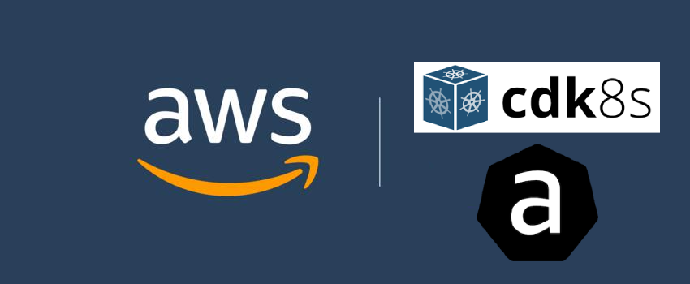

<p align="center">
  <a href="https://dev.to/vumdao">
    
  </a>
</p>
<h1 align="center">
  <div><b>Use CDK8S To Create AWS Controllers for Kubernetes Custom Resources</b></div>
</h1>

## Abstract
- There is question, How does ACK relate to [cdk8s](https://cdk8s.io/)?
- [Answer](https://aws-controllers-k8s.github.io/community/docs/community/faq/#cdk8s): All of the ACK controllers watch for specific CRs and you can generate those resources using cdk8s. The two projects complement each other. cdk8s can create the Kubernetes resources and ACK uses those resources to create the AWS infrastructure.
- This post gives example of generating kubernetes manifest of ACK using cdk8s typescript


## Table Of Contents
 * [Pre-requisite](#Pre-requisite)
 * [Init cdk8s-app projen](#Init-cdk8s-app-projen)
 * [Import ACK CRDS As CDK8S API](#Import-ACK-CRDS-As-CDK8S-API)
 * [Get your hands dirty with code now](#Get-your-hands-dirty-with-code-now)
 * [Build manifest](#Build-manifest)
 * [Conclusion](#Conclusion)

---

## 🚀 **Pre-requisite** <a name="Pre-requisite"></a>
- This post expects you have knowledge of [ACK](https://aws-controllers-k8s.github.io/) and cdk8s.
- You can base on the [AWS Controllers for Kubernetes Hands-on](https://dev.to/aws-builders/aws-controllers-for-kubernetes-hands-on-2d70) to test the generated manifests by cdk8s
- [projen](https://github.com/projen/projen) is a plus

## 🚀 **Init cdk8s-app projen** <a name="Init-cdk8s-app-projen"></a>
- You can just init cdk8s project using `cdk8s init typescript-app` but following is used projen to mange configuration through code
- Init `cdk8s-app-ts` with projen in typescript.
  ```
  ⚡ $ projen new cdk8s-app-ts --projenrc-ts
  ```

- cdk8s import
  ```
  ⚡ $ cdk8s import --language typescript --output src/imports
  Importing k8s v1.22.0...
  Importing resources, this may take a few moments...
  k8s
  ```

## 🚀 **Import ACK CRDS As CDK8S API** <a name="Import-ACK-CRDS-As-CDK8S-API"></a>
- [s3-controller crds](https://github.com/aws-controllers-k8s/s3-controller/tree/main/helm/crds)
  ```
  ⚡ $ cdk8s import https://raw.githubusercontent.com/aws-controllers-k8s/s3-controller/main/helm/crds/s3.services.k8s.aws_buckets.yaml --output src/imports/
  Importing resources, this may take a few moments...
  s3.services.k8s.aws
    s3.services.k8s.aws/bucket
  ```

- [rds-controller crds](https://github.com/aws-controllers-k8s/rds-controller/tree/main/helm/crds), rename file from `rds.services.k8s.aws.ts` to `rds.services.db.instance.k8s.aws.ts` after import due to that name is assigned for all CRDS with in the `rds-controller` crds
  ```
  ⚡ $ cdk8s import https://raw.githubusercontent.com/aws-controllers-k8s/rds-controller/main/helm/crds/rds.services.k8s.aws_dbinstances.yaml --output src/imports/
  Importing resources, this may take a few moments...
  rds.services.k8s.aws
    rds.services.k8s.aws/dbinstance

  ⚡ $ mv src/imports/rds.services.k8s.aws.ts src/imports/rds.services.db.instance.k8s.aws.ts
  ```

- RDS subnet group, rename file from `rds.services.k8s.aws.ts` to `rds.services.subnet.group.k8s.aws.ts`
  ```
  ⚡ $ cdk8s import https://raw.githubusercontent.com/aws-controllers-k8s/rds-controller/main/helm/crds/rds.services.k8s.aws_dbsubnetgroups.yaml --output src/imports/
  Importing resources, this may take a few moments...
  rds.services.k8s.aws
    rds.services.k8s.aws/dbsubnetgroup

  ⚡ $ mv src/imports/rds.services.k8s.aws.ts src/imports/rds.services.subnet.group.k8s.aws.ts
  ```

## 🚀 **Get your hands dirty with code now** <a name="Get-your-hands-dirty-with-code-now"></a>
- [RDS](https://github.com/vumdao/aws-cdk8s-ack-cr/src/rds)
  ```
  rds
  ├── constants.ts
  ├── db-instance.ts
  └── subnet-group.ts
  ```

  - DBInstance requires subnet group which contains private subnets in EKS VPC (`subnet-group.ts`) and secret keys to hold user credential. The k8s secret is not generated through code here.
  - `db-instance.ts` defines specs of `DbInstance`

- [S3](https://github.com/vumdao/aws-cdk8s-ack-cr/src/s3)
  ```
  s3
  ├── constants.ts
  └── s3.ts
  ```

## 🚀 **Build manifest** <a name="Build-manifest"></a>
- Just run `yarn build`
```
⚡ $ yarn build
yarn run v1.22.15
warning ../../../package.json: No license field
$ npx projen build
👾 build » default | ts-node --project tsconfig.dev.json .projenrc.ts
👾 build » compile | tsc --build
👾 build » post-compile » synth | cdk8s synth
No manifests synthesized
👾 build » test | jest --passWithNoTests --all --updateSnapshot
No tests found, exiting with code 0
----------|---------|----------|---------|---------|-------------------
File      | % Stmts | % Branch | % Funcs | % Lines | Uncovered Line #s
----------|---------|----------|---------|---------|-------------------
All files |       0 |        0 |       0 |       0 |
----------|---------|----------|---------|---------|-------------------
👾 build » test » eslint | eslint --ext .ts,.tsx --fix --no-error-on-unmatched-pattern src test build-tools .projenrc.js
Done in 25.90s.
```

- Output directory
  ```
  dist
  ├── rds
  │   ├── rds-db-instance.yaml
  │   └── rds-subnet-group.yaml
  └── s3
      └── s3-test-bucket.yaml
  ```

- We can now use the `yaml` files to create the AWS infrastructure through ACK

## 🚀 **Conclusion** <a name="Conclusion"></a>
- Although we have to import ACK CRDS resources for cdk8s API, we can manage k8s manifests through code

---

<h3 align="center">
  <a href="https://dev.to/vumdao">:stars: Blog</a>
  <span> · </span>
  <a href="https://github.com/vumdao/aws-cdk8s-ack-cr/">Github</a>
  <span> · </span>
  <a href="https://stackoverflow.com/users/11430272/vumdao">stackoverflow</a>
  <span> · </span>
  <a href="https://www.linkedin.com/in/vu-dao-9280ab43/">Linkedin</a>
  <span> · </span>
  <a href="https://www.linkedin.com/groups/12488649/">Group</a>
  <span> · </span>
  <a href="https://www.facebook.com/CloudOpz-104917804863956">Page</a>
  <span> · </span>
  <a href="https://twitter.com/VuDao81124667">Twitter :stars:</a>
</h3>
